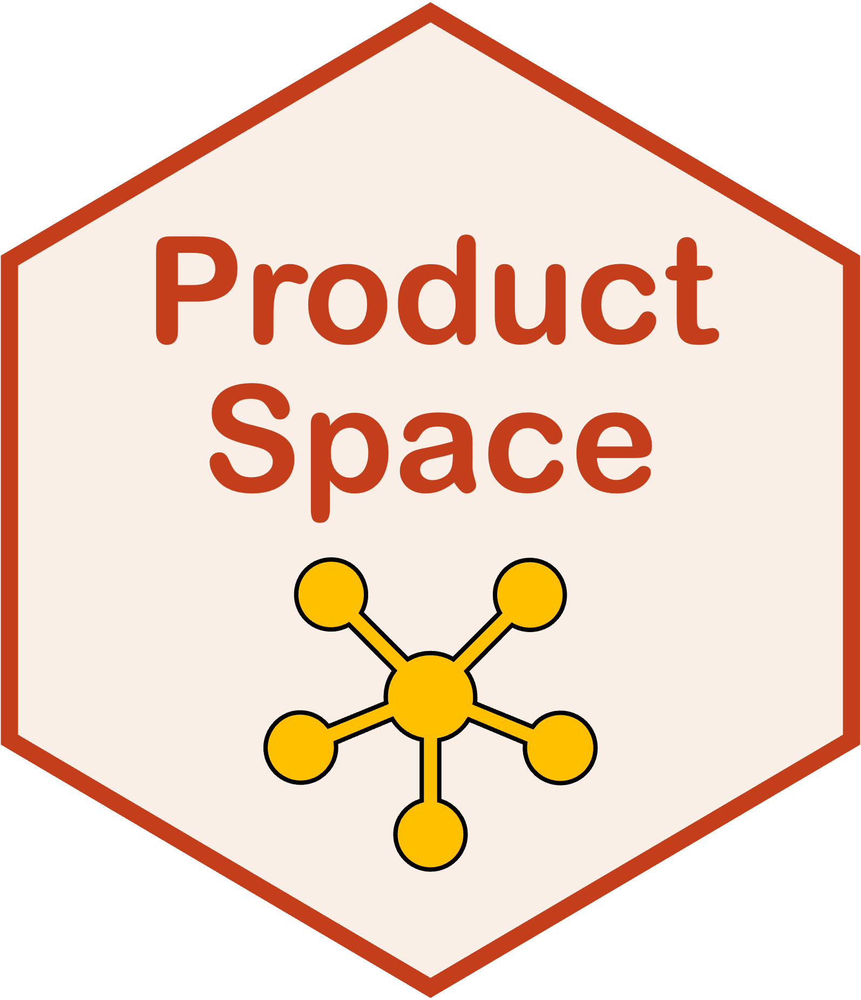

# ProductSpace 

<!-- badges: start -->
[](https://github.com/Carol-seven/ProductSpace/actions/workflows/R-CMD-check.yaml)
<!-- badges: end -->

The goal of **ProductSpace** is to provide tools for the analysis and visualization of the
product space.

## Installation

You can install the development version of **ProductSpace** from [GitHub](https://github.com/)
with:

``` r
# install.packages("devtools")
devtools::install_github("Carol-seven/ProductSpace")
```
